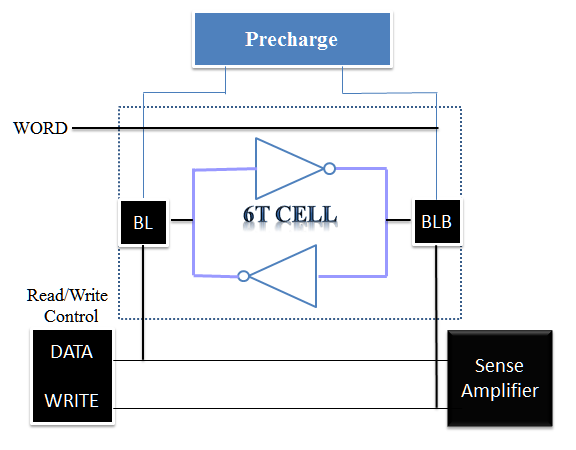
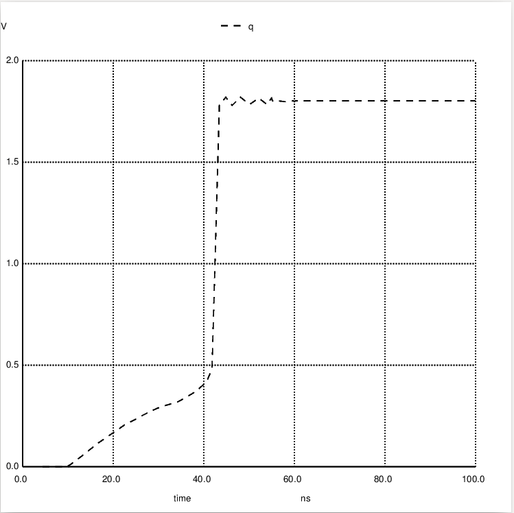
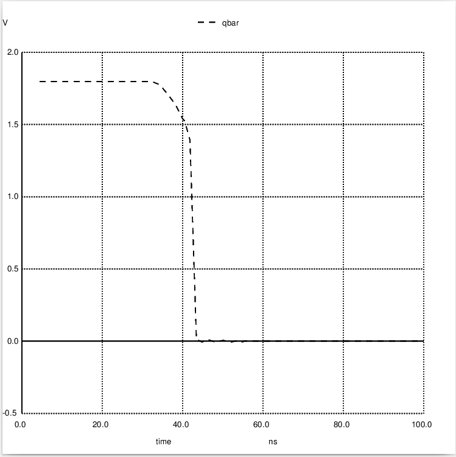
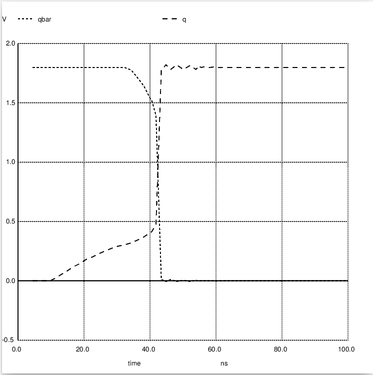
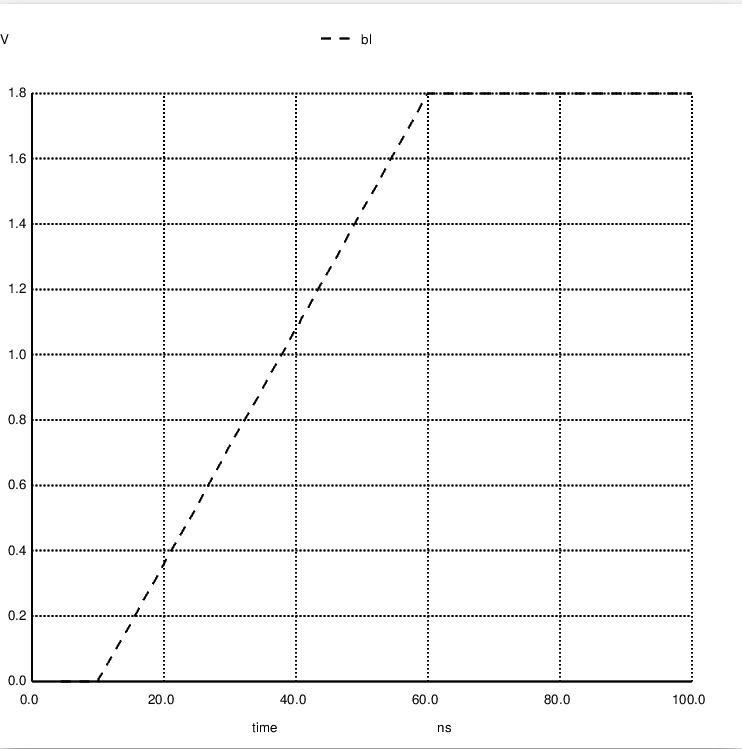
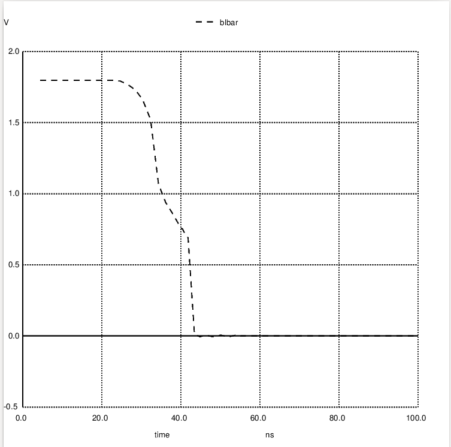
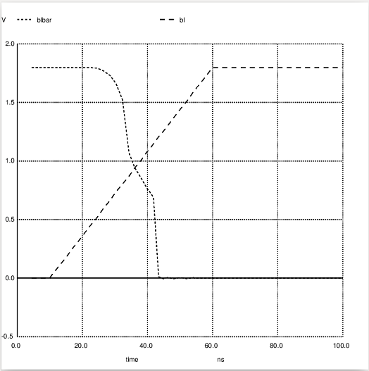
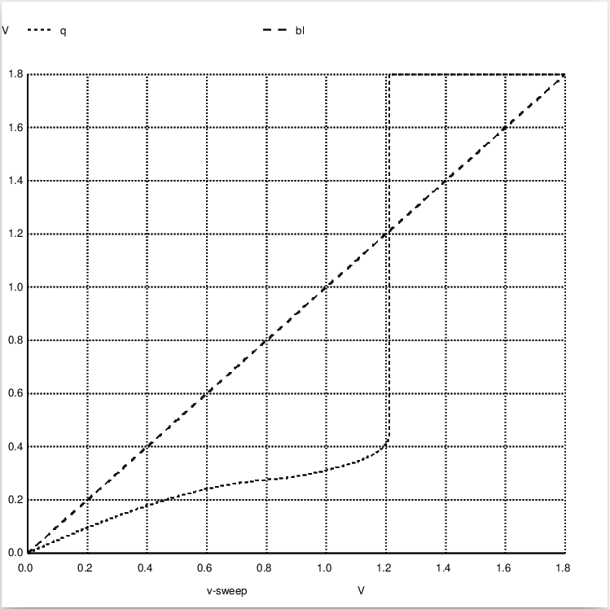

# vsdsram
### An SRAM IP Uniquely designed with open source tools.

Static RAM is a type of random-access memory that uses latching circuitry (flip-flop) to store each bit.

The Size of SRAM Specs is 32kbit/4k Bytes with 1.8v. 

To get insight of mem4kBytesOr32kbits design Specifications, check [this](/Documentation/mem4kBytesOr32kbitsSpec.pdf).

## Block Symbol and pins




## Upcoming Future Works

The Circuit design of 6T SRAM alongwith Precharge, Sense amplifier is designed solely in opensouce tool and its characterstics is analyzed. As a post layout stage, the design's layout is drawn and spice netlist is extracted. As a part of upcoming work the next step is post layout simulation, verifying it with pre layout. The32kbit and PnR (Place and Route) flow and lastly GDS to be released.

## IP USAGE

The user of this IP has to install `Ngspice` for Circuit simulation and `Magic` for Layout.

## Getting Started with NGspice: An open Source Circuit Simulator

*For ubuntu linux*

To Install Ngspice, Open terminal and Type 

`sudo apt-get install -y ngspice`

### To Clone the IP Repository

1. Download the Zip file or use `git clone https://github.com/Anushar123/vsdsram`

2. Change the path or directory using `cd vsdsram/Circuit-Inv` to view the circuit.

3. Change the path or directory using `cd vsdsram/Netlist` to run the simulation.

### To run PreLayout Simulations

1. Go to the path or directory using `cd vsdsram/Netlist`

3. *To simulate transient Analysis* type :`ngspice Sram.cir.out`

   Or

   Type `ngspice` in terminal

   ngspice 1 -> source Sram.cir.out

### To View Simulation Plots:

ngspice 1 -> plot q



ngspice 1 -> plot qbar

 

ngspice 1 -> plot q qbar

 
 
 ngspice 1 -> plot bl

 
 
 ngspice 1 -> plot blbar

 
 
 ngspice 1 -> plot bl blbar

 
 
 
*To simulate dc Analysis*
 
Type :`ngspice sramdc.cir.out`

ngspice 1 -> plot bl q



 
To exit from Ngspice Shell type:

ngspice 1 ->  exit

## Getting Started with Magic Layout

Magic is a venerable VLSI layout tool, written in the 1980's at Berkeley by John Ousterhout, now famous primarily for writing the scripting interpreter language Tcl. Magic has remained popular with universities and small companies.

*For ubuntu linux*

Download Magic from this [link](http://opencircuitdesign.com/magic/)


```html
Open Terminal and type below commands. 
cd Downloads/
tar xzf magic-7.5.232.tgz
cd magic-7.5.232/
sudo apt-get install m4
sudo apt-get install tcl-dev
sudo apt-get install tk-dev
sudo apt-get install blt
sudo apt-get install freeglut3
sudo apt-get install libglut3
sudo apt-get install libgl1-mesa-dev
sudo apt-get install libglu1-mesa-dev
./configure
sudo apt-get install csh
sudo make
sudo make install
```
Or

Install Qflow & It will install all necessary open source tools including magic.

Download qflow from this [link](http://opencircuitdesign.com/qflow/)

```html
Open Terminal and type below commands. 
cd Downloads/
tar xzf qflow-1.4.83.tgz
sudo apt-get update
sudo apt-get install qflow
```


### To View Magic Layouts

1. Open the repository and change directory to `cd vsdsram/Layout`

2. To view the layout, type on terminal : `magic sram6.mag` or `magic -T SCN6M_SUBM.10.tech sram6.mag`

3. Similarly for precharge and senseamplifier: `magic precharge6.mag` & `magic senseamplifier6.mag`

3. To extract the spice netlist : Go to Tkcon window and type these commands.

`extract all`

`ext2spice rthresh 0 cthresh 0` **To include Parasitics in spice netlist** 

`ext2spice`

 


 


 


 


 


Note: IP is yet under process and yet to release as a final view. 

But incase if any difficulties with respect to IP Usage so far, contact the administrator or report as github Issue.

## Author
Anusha R

# Contact Information
* Anusha.R Mtech (VLSI Design and Embedded Systems), Bangalore. anusha005r@gmail.com
* Kunalghosh Director VSD Corp.Pvt.ltd Kunalghosh@gmail.com
* PHILIPP GUHRING Software Architect at LibreSilicon Association pg@futureware.at
* Dr. GAURAV TRIVEDI Co-Principal Investigator,ECIT Academy and Associative Professor, EEE Department, IIT Guwahati trivedi@iitg.ac.in
