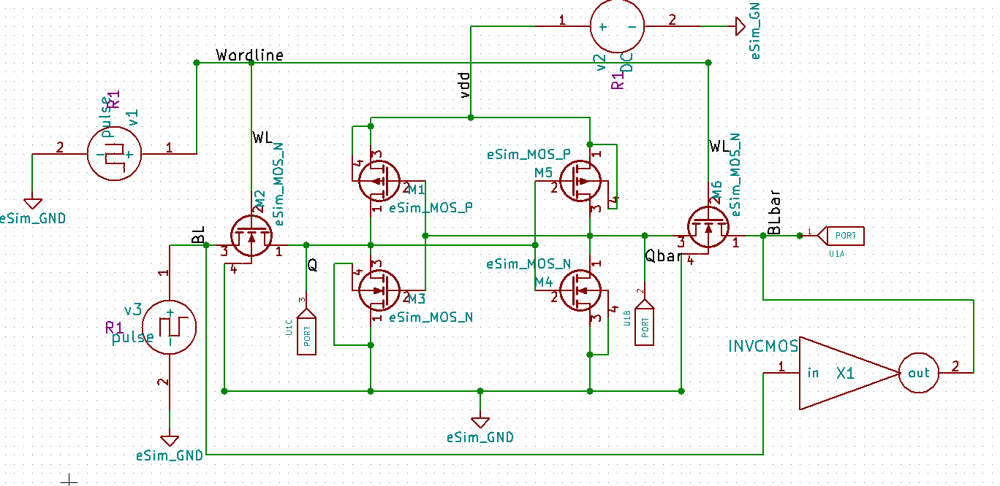
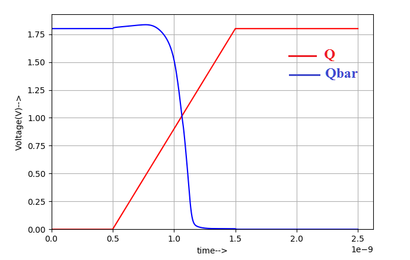
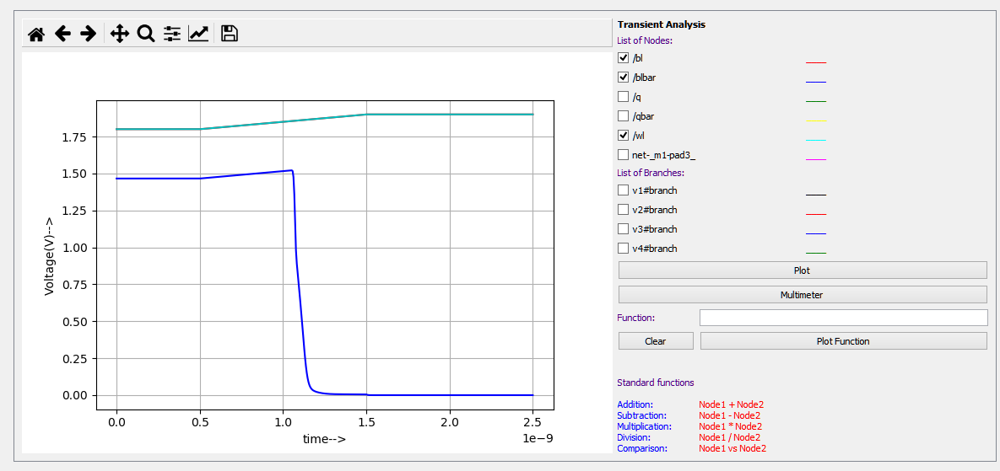
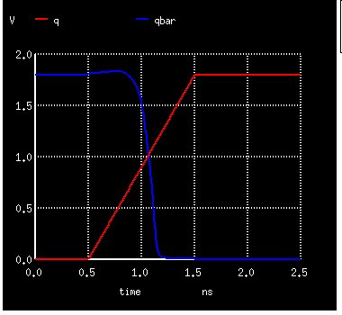
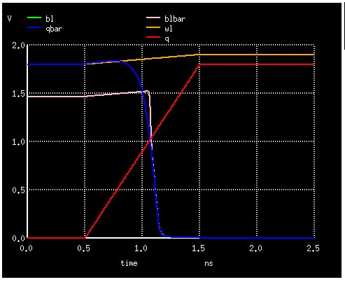

# Design Your Own SRAM IP (Static RAM).
This Project contains files to develop SRAM on any open source circuit EDA tool.
# Installation of ESIM
```html
If you are using Windows Version
```
1. Download ESIM from this link : https://esim.fossee.in/downloads
2. After download click on the .exe file;  A window pops up for installation.
3. Follow intructions to complete esim Installation.
4. To run eSim you can directly click on esim icon.

```html
If you are using ubuntu linux version
```
1. Download ESIM for Ubuntu from this link: https://esim.fossee.in/downloads
2. Open terminal or type `Ctrl+Alt+t` to open command terminal.
3. Change the directory using cd command followed by path to zip file.
4. Unzip the zip file using command: `unzip -q filename.zip` 
   Or use command: `unzip filename.zip -d /path/to/directory`; in case if ZIP file is in different directory
5. Change to eSim folder using cd command.
6. To install type: `./install-linux.sh --install`
7. After Installation, to run eSim you can directly run it from terminal by typing `esim`.
 
#  Getting Started with Windows ESIM
1. Create `new project` in a Specific directory.
2. Click on `new Schematic`
3. Schematic Editor opens
4. Draw the schematic and save it.

### Schematic of Sramcell



### Schematic of Precharge


### Schematic of SenseAmplifier


5. `Annotate` the schematic. 
6. Perform `Electrical rules check`, to check errors
7. Convert schematic into netlist from the toolbar icon. 
8. Click on the `kicad conversion` icon on left side of window for conversion of Kicad to ngspice netlist. Choose and Fill up Analysis(transient or Dc) and Source details, along with device modelling(`Attaching libraries for pmos and nmos`). 
9. Click on Convert, Kicad to Ngspice conversion will be successfull.
10. Click on simulation icon on left toolbar window.
11. A ngspice terminal opens up for execution, along with ngspice python/simulation plot.
12. Choose appropriate nodes and click on plot to view waveforms.



# Getting Started with Ubuntu-Linux Ngspice Simulation
To Install Ngspice, Open terminal and Type 
`sudo apt-get install -y ngspice`
### To run Simulation
1. Download the files or use `git clone **Paste GitHub link**`

2. Change the path or directory using `cd/SRAM/Netlist`

3. To Simulate type :`ngspice Sramcell.cir.out`

   Or

   Type `ngspice` in terminal

   ngspice 1 -> source Sramcell.cir.out

### To View Simulation Plots:

ngspice 1 -> plot q qbar



ngspice 1 -> plot q qbar wl bl blbar

 


To exit from Ngspice Shell type:

ngspice 1 ->  exit

# Contact Information
* Anusha.R Mtech (VLSI Design and Embedded Systems), Bangalore. anusha005r@gmail.com
* Kunalghosh Director VSD Corp.Pvt.ltd Kunalghosh@gmail.com
* PHILIPP GUHRING Software Architect at LibreSilicon Association pg@futureware.at
* Dr. GAURAV TRIVEDI Co-Principal Investigator,ECIT Academy and Associative Professor, EEE Department, IIT Guwahati trivedi@iitg.ac.in
